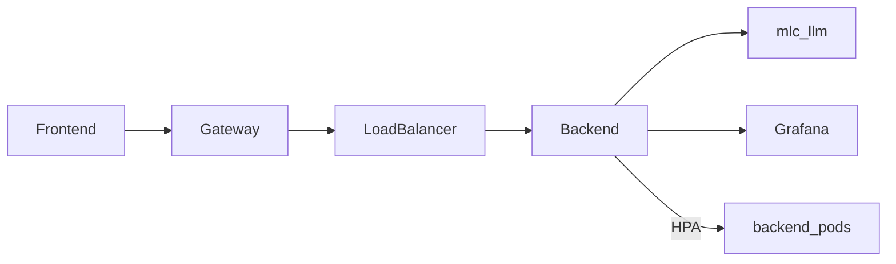

# ReviewGuard — infrastructure

Local Docker Compose stack and optional Kubernetes manifests for the API gateway, MLC LLM service, observability, and horizontal scaling.



## Docker Compose

From the repository root:

```bash
docker compose up --build

# scale backend replicas (nginx resolves Compose DNS)
docker compose up --build --scale backend=2
```

| Service | URL |
|---------|-----|
| API gateway | http://localhost:8088 |
| MLC LLM | http://localhost:8000/health |
| Grafana | http://localhost:3001 (default `admin` / `admin`) |
| Prometheus | http://localhost:9090 |
| Loki | http://localhost:3100 |

Run the UI on the host against the gateway:

```bash
cd frontend
echo 'NEXT_PUBLIC_API_URL=http://localhost:8088' > .env.local
npm install && npm run dev
```

### Layout

| Path | Role |
|------|------|
| [`gateway/nginx.conf`](gateway/nginx.conf) | Reverse proxy / load balancer entrypoint |
| [`prometheus/`](prometheus/) | Scrape config for backend `/metrics` |
| [`grafana/`](grafana/) | Datasources and ReviewGuard dashboard |
| [`loki/`](loki/) · [`promtail/`](promtail/) | Log aggregation |
| [`../services/mlc-llm/`](../services/mlc-llm/) | OpenAI-compatible MLC LLM image |
| [`../k8s/reviewguard.yaml`](../k8s/reviewguard.yaml) | Deployments, Services, Ingress, HPA |

## Kubernetes

Build images, load them into a local cluster (kind/minikube), then apply:

```bash
docker build -t reviewguard-backend:local ./backend
docker build -t reviewguard-mlc-llm:local ./services/mlc-llm
kubectl apply -f k8s/reviewguard.yaml
```

| Resource | Purpose |
|----------|---------|
| Ingress | HTTP gateway |
| Service (ClusterIP / NodePort) | Service discovery and load balancing |
| HorizontalPodAutoscaler | Scale `backend` on CPU (target 70%, min 1, max 5) |

NodePorts in the sample manifest: API `30080`, Grafana `30300`.

## Backend environment

| Variable | Notes |
|----------|-------|
| `MLC_LLM_URL` | e.g. `http://mlc-llm:8000` (set automatically in Compose) |
| `MLC_MODEL_ID` | Default `gemma-2-2b-it-q4f16_1-MLC` |
| `LLM_TIMEOUT` | Default `60s` |
| `CORS_ORIGINS` | Default `http://localhost:3000` |

If `MLC_LLM_URL` is unset, `POST /reviews` responds with `llm_unavailable`.
